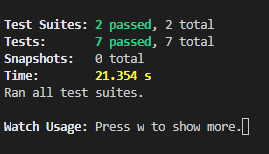
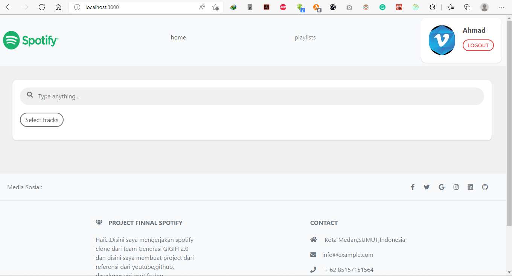

# Go Spotify Clone Project

## Deskripsi

Go Spotify Clone merupakan sebuah project aplikasi dari api <a href="https://developer.spotify.com/">Spotify</a> dan di modifikasi menjadi sebuah aplikasi yang berbentuk pencarian lagu dan create playlist. Project ini dibuat secara during bersama team Generasi GIGIH 2022 program by GOTO organisasi, <a href="https://www.anakbangsabisa.org/">Yayasan Anak Bangsa Bisa</a>

### Fitur-Fitur

- Login with Spotify account
- User profile
- Picture Profile
- Nav Bar
- Search tracks
- List user's playlists
- Create new playlist
- Playlist detail
- List all tracks in a playlist
- Track detail
- Footer

### Stacks

- Create-react-app, React, Typescript,Test  JS
- Styling: CSS, FontAwesome Icons, Boostrap 5, Mdb, Twailind.
- State management: Redux
- Testing: Jest, Testing-Library, MSW
- Linter: ESLint
- Deployment: Vercel

## Cara membuat react native

```
npx create-react-app myapp
kemudian 
cd myapp
```

## Penggunaan Repository

1. Git Clone The Repo

```
git clone
https://github.com/AhmadDev02/GoSpotify.git
```

2. Buka comand kamu di clone project gospotify

```
cd spotify
```

3. Package Yang kamu harus didownload apabila kamu membuat file project js atau bisa configuration dengan repo yang kamu download tadi

```
- npm install -D tailwindcss postcss autoprefixer
- npm i redux
- npm i axios
- npm install -D typescript @types/jest @types/react @types/react-native @types/react-test-renderer
- npm install react-redux @reduxjs/toolkit
- npm install react-router-dom@5.3.0 
- npm install eslint --save-dev
- npm i @reduxjs/toolkit 
- npm audit fix --force
- npm instal eslint-plugin-react-hooks --save-dev
- npm i mdb-react-ui-kit
- npm install --save mdbreact
- npm install --save jquery popper.js
- npm i styled-components react-icons
- npm i react-bootstrap
- npm install react-bootstrap bootstrap
```

4. Menjalankan Program nya

```
npm start 
or 
yarn start
```

## Note For .env

1. Jika Anda buka dilocal host maka anda wajib mengubah

```
REACT_APP_ROOT_URL=http://localhost:3000 


dan 


REACT_APP_REDIRECT_URL=http://localhost:3000/callback
```

2. Jika Anda ingin membuka aplikasi nya ke vercel maka anda harus mengubah ke

```
REACT_APP_ROOT_URL=https://go-spotify.vercel.app/

dan 

REACT_APP_REDIRECT_URL=https://go-spotify.vercel.app/callback
```

## Cara Configurasi Testing

1. Instal

```
- npm i --save-dev @testing-library/jest-dom
```

2. Memasukan jest kedalam .eslintrc.json

```
Menambahkan jest nya di dalam "env"
- "jest": true
```

3. Kemudian menambahkan file import jest-dom ke dalam file test.js

```
import '@testing-library/jest-dom';
```

4. Menjalankan Testing

```
npm test
```

<table>
  <tr>
    <td>
      
    </td>
  </tr>
</table>

### Hasil Akhir

<table>
  <tr>
    <td>
      
    </td>
  </tr>
</table>

## Terima kasih
